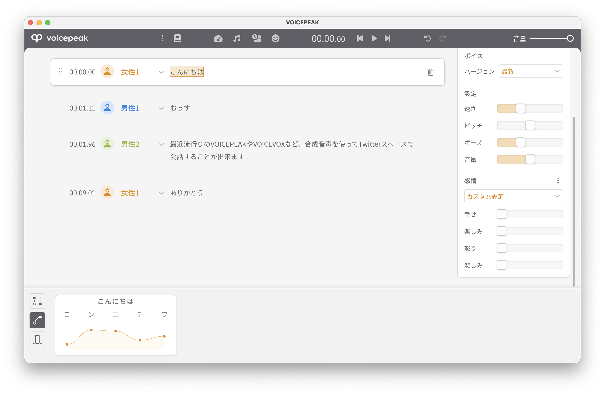
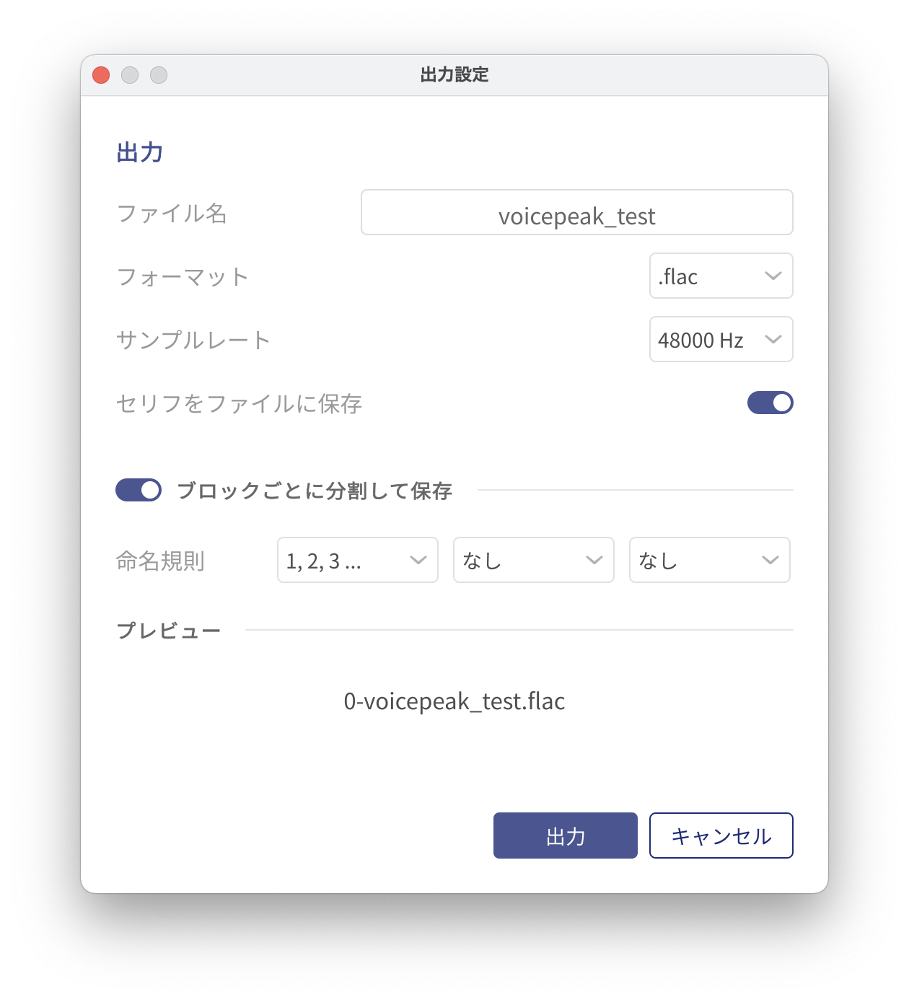

# SubtitleCreatorFromFlac

## 概要
このプロジェクトは、指定したディレクトリに存在する.flacオーディオファイルと、そのオーディオに対応するセリフ（.txtファイル）を用いて、字幕ファイル（SRT形式）を自動生成するPythonスクリプトです。

主な機能は以下のとおりです：

1. 指定したディレクトリから.flacファイルを連続で読み込みます。
2. それぞれの.flacファイル名と同名の.txtファイル（セリフ）を読み込みます。
3. .flacファイルの音声の再生時間を計算します。
4. セリフと音声の時間をもとに、SRT字幕ファイルを生成します。

## 使用方法 (SRT版)
1. まずはこのリポジトリをクローンまたはダウンロードします。
2. 次に、Pythonの必要な依存関係をインストールします。Terminalやコマンドプロンプトを開き、以下のコマンドを実行します：
    ```bash
    pip install -r requirements.txt
    ```
3. VOICEPEAKの場合は次のようにして連番のflacファイルとセリフのファイルを生成します。重要な点は「セリフをファイルに保存」をオンにしていること、「ブロックごとに分割して保存」していることです。


4. スクリプトを実行します：
    ```bash
    python create_srt.py <your_directory>
    ```
    ここで`<your_directory>`は.flacファイルと.txtファイルが格納されているディレクトリのパスです。

## 使用方法 (JSON版)
JSONは別に制作しているRemotionで動画（ゆっくり動画のようなイメージ）を生成するときに字幕と音声を自動的に同期させるために使います。単独では役に立たないかも知れません。


重要な点は「セリフをファイルに保存」をオンにしていること、「ブロックごとに分割して保存」していることに加えて「命名規則」で「ボイス名」を2番目に指定していることです。

Remotionではフレーム数で時間を指定します。

これによって字幕が出現する時間（フレーム数）、字幕が消える時間（フレーム数）、誰が喋るか、テキストの4項目をJSONで出力します。


## ライセンス
このプロジェクトはMITライセンスのもとで公開されています。詳細は[LICENSE](LICENSE)ファイルをご覧ください。
